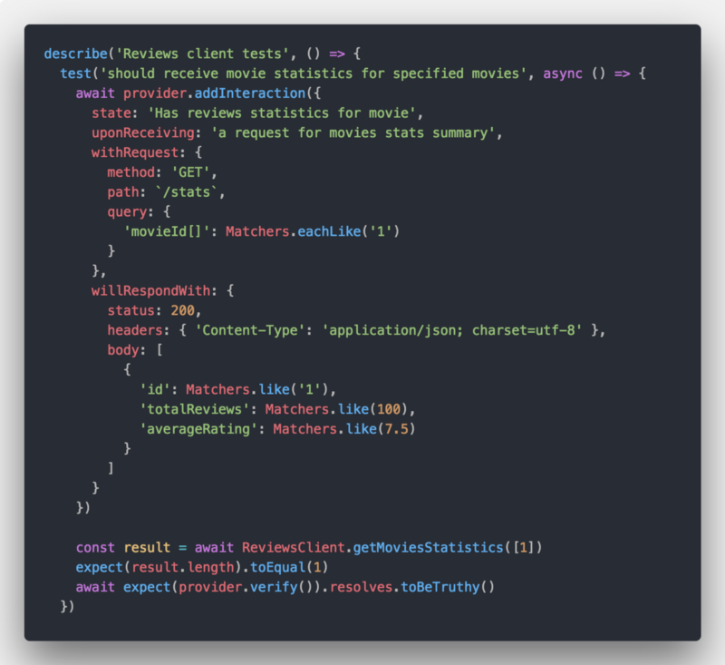

# A Comprehensive Guide to Contract Testing APIs in a Service Oriented Architecture

It is likely you experienced the painful situation of deploying to production only to find out that an API service you integrate with has broken the contract. How can we effectively ensure this does not happen?

Whether Monoliths or Microservices, it is likely that your architecture now or in the future will evolve to include API interactions between autonomous services in your infrastructure.

When a Service Oriented Architecture shapes-up (i.e: microservices), there is a high level of importance of testing these API interactions in order to add a layer of confidence as different teams deploy new versions and risk breaking an API contract with some of the other teams they integrate with.

In this guide we will review how to  **practically adopt the Consumer-Driven Contracts**  (CDC) pattern to address this situation and deploy with confidence, while maintaining a lean End-to-End infrastructure.

## Preface and Pre-requisite

When applying a consumer driven development methodology, our goal is to establish API contracts between two parties and verify during tests of each party that both parties uphold their part of the contract.

As an example, these two parties can be a Frontend and a Backend, or two Backend services integrating with each other.

To do so, we use  [Pact](https://docs.pact.io/)  which is a set of libraries and frameworks developed and open sourced by the  [Pact Foundation](https://github.com/pact-foundation)  to implement the pattern.

The Pact team has done an amazing job of documentation the library, adding examples and practices so don’t skip their developer docs when in question: [https://docs.pact.io](https://docs.pact.io/)

For this guide, you will need:

1.  A git workflow — The consumer teams embrace and practice the  [Trunk Based Development](https://trunkbaseddevelopment.com/)  workflow where there is a single line of development (i.e:  **_master_**  branch) and there are no long-lived feature branches.
2.  JavaScript and Node.js experience — The practical code examples provided in this guide are based on teams with services built with Node.js, however it applies to other platforms as well.

## The Motivation for Consumer-Driven Contract Testing

Once upon a time in a galaxy far, far away, most of us followed this standard architecture for building web applications:

You can easily fill in the text for the squares by yourself.  
Some options are:

-   Tomcat, Oracle
-   PHP, MySQL
-   .NET, MSSQL

They weren’t that bad, right? Just think about how easy it was when you had o**ne database**,  **one repository**. How easy it was to  **monitor them** — just one view and one system to track.  **Business domain evolution**, and the processes around that were easy. Testing monoliths was rather easy as well

But Monoliths shows its weakness as teams, traffic, business and complexity scales up.

So we ventured into embracing the Service Oriented Architecture to its full power. Here is Amazon’s collection of microservices around 2009 to remind you what the two squares evolve to when this happens:

Sure enough I’m deliberately drawing an extreme here, but even for small products — the business domain splits across several services and teams, different data stores, some infrastructure middlewares (auth, user management, communication messaging, configuration, etc).

With all that in mind, this begs the question —   
**How do you test a system with many dependencies and autonomous teams that make up the system? How do you ensure that continuous delivery and deployment do not break API contracts?**

Let’s take a use-case:

-   Team A is responsible for movies
-   Team B is responsible for reviews

Each team’s test and delivery pipeline is made up of common testing practices such as unit, integration and end-to-end testing. But the real question is how does each team tests its services, and manages to deploys independently to production, without breaking the API contract?

### Option 1 — Test using Mocks

Your system (End-to-End or Integration) testing is using mocks for the services the team depends on.Why would you choose to do that?

-   Because spinning up and down test environments for CI or E2E tests is complicated and requires to bring up real service dependencies (i.e: their databases), configure them properly, resolve versioning appropriately, and so on.
-   Regardless of the complexity required, it is slow and resource-heavy (which translates to money) to support this setup.

Benefits of using mocks are: quick tests, cheap, fast to implement, deterministic tests.

The downside? Not reliable in the real world, beyond your local setup.  
You’re testing based on assumptions on how API contracts were implemented, but whom to say that the team you integrate with didn’t just break the API in a recent release?

### Option 2— Test with real dependencies

You don’t buy-in to mocks. You need confidence. Why do you invest in all of those tests if you can’t ensure that going to production you will not be breaking an API that another team depends on you with?

So you go ahead and default to the naive approach — let’s bring up all of those services that I need when I’m running my End-to-End tests in CI!

It resembles something like the below picture, right:

You end up needing to maintain a bloat environment with many dependencies and orchestrate them to work together. Let’s not even mention the added complexity with seeding data into those other services you need.

Do you remember the Testing Pyramid? As you move up the pyramid of tests towards End-to-End tests, they become slow, and pricey.

## Introducing: Contract Testing

What if I told you that you can win both worlds?

-   All the benefits of using mocks — quick tests, easy environment setup, and deterministic tests.
-   All the benefits of a fully deployed E2E — reliability and confidence when deploying to production.

To put it simply — with contract testing, you work with mocks that represent the agreed-upon API contract between the services, but also, the services (or teams really) that provide the API for consumption have to uphold that API contract that is used in those mocks, and the contract is enforced in their CI so they can’t break the API and go to production.

## The Players in Contract Testing

The  [Pact Framework](https://docs.pact.io/)  is an open source project for contract testing with support for several platforms like Ruby, JavaScript, Java and others through its set of libraries.

#### Terminology

1.  **Consumer** — any party that interacts with a dependent service through an API (HTTP, event-based, etc). This often drills down to be a backend interacting with another backend API, but it doesn’t have to be. A browser frontend is also a valid party that depends on a backend API and is considered a consumer.
2.  **Provider** — any party that provides a service for interacting with to its dependents.
3.  **Contracts** — just like law enforceable agreements, these contracts represent a set of interactions with expected request and response structures. Through-out this document we will use Pacts and Contracts interchangeably to refer to the contract.
4.  **Broker** — the contracts need a place to be stored. It can be any generic assets server, but its better if they are versioned, so version control is a choice. A better choice is to use the  [Pact Broker](https://github.com/pact-foundation/pact_broker)  which is suited for this exact need and is open source, and the good folks at  [DiUS](https://dius.com.au/)  also provide a free hosted version of it if you’re just starting out.

**The consumer**  part is defining the API contract by setting expectations of the provider request and response structure. These sets of interactions make the contract between a consumer and its provider.

**The contract**  is then published to a pact broker which is a central place to inspect and manage the contracts.

The  **pact broker**  holds the contracts and provides added value such as displaying whether contracts have been verified, what interactions exist between services, and other features.

**The provider**  is providing the API, and in its turn, pulls contracts from the broker to run its test against, and verify whether its own test suite is breaking or not, which it then reports back to the broker.

> Note: through-out the guide we will be using CDC as short for Consumer-Driven Contracts, and pacts as an alias for the contracts.

## Contract Testing

### **Lifecycle**

Following is a high level overview for the workflow of contract testing between a consumer and a provider team.

The cycle starts with the top-left side of the picture where the consumer team initiates a collaboration  about the requirements for the contract with the provider team.

Once both teams have agreed on the API contract, the consumer team can venture into writing tests that manifest the interactions and their expectations. The result of running these tests will become the contract, in essence, being a JSON representation of the API contract specifying all the expected interactions.

These contracts have to live somewhere. While you are free to host them straight up on a git repository, or in an artifact repository such as [Nexus](https://www.sonatype.com/nexus-repository-oss) or [Artifactory](https://jfrog.com/artifactory/), there’s a huge benefit of using Pact’s own solution to host them and that’s called the Pact Broker. Some of the benefits include: visibility of service dependencies, webhooks, visibility into contract verification status, and much more. Needless to add — it is open source so you can spin up your own broker in a container.

Later in the future, the provider team implements the API contracts for its consumer.

What if the provider team didn’t implement the contract as was expected and agreed upon by the consumer? What if at first release the API worked as expected, but a couple of releases down the road the provider team broke the API contract by modifying some of the semantics in the response payload?

To catch these cases and enforce the API contract upon the provider before it even pushes a release, the provider in its CI pipeline downloads the contracts of all of its consumers and run the required provider testing to confirm it didn’t break anything.

### Consumer Contract Testing

A consumer will typically have a client class or utility helper in the project that performs the calls to the provider. The consumer tests in essence revolve around running unit tests for that helper, involving the Pact framework’s mock service to reply with canned responses based on the set expectations during the unit test setup. The result of a successful contract test run is the Pact contract file between the consumer and provider.

This means that the consumer tests are used to define the contract, and unit testing the consumer’s client code for interacting with the provider, but will not really have any reason to fail. A broken contract doesn’t fail the consumer’s build or CI because when the consumer tests are running they work with the Pact’s mock service and don’t spin up any real provider.

With that said, the provider mocking doesn’t make consumer testing useless. At the very least, they unit tests the consumer’s API helper.

#### The HTTP Client Library

The Movies microservice has an HTTP client utility library that helps in making calls to the Reviews service, handling the data transfer objects, manipulating as necessary, and so on. It makes sense you’ll have one, right?

It may look like this: 

Above: An HTTP Client library helper to interact with another dependency (i.e: another service over HTTP)

#### Consumer Mock Setup

Per the guideline set out previously, we’ll unit test the HTTP client helper for the Reviews service. We will aim for asserting both the helper logic (massaging of the data for example), as well as use this as a base for the API contract testing.

Without using Consumer Contract Test you would have mocked the HTTP response in some way, right? May you would’ve completely stub this out with something like Sinon or Jest, or maybe you would have used Nock.

Either way, you had to mock it.  
This is where the Pact framework comes in, and provides you this mock, plus, you get a contract drafted by using it. Win-win situation.

Beginning our Reviews Service mock consumer test:

The above starts the consumer test code with the following tasks:

1.  Before all tests are run, we need to setup the Pact mock service, so we initialize a new instance with information like the consumer and provider name, and which port to listen on for requests.
2.  After all the tests ran, as in, all the API requests that make up the contract have been made, we call on  `finalize()`  which creates a new Pact contract file in the  `/pacts`  directory.

#### A Contract Test Case

When practicing Consumer contract testing, the bulk of the test is about declaring the contract. By definition, every contract test has 2 parts which is made up in an interaction:

1.  Declaring the Request — in the  `withRequest`  clause all the details making up this individual request are stated.
2.  Declaring the Response — in the  `willRespondWith`  clause we are setting up the expectations with regards to the API response.

Consumer Contract Test code

The  `state`  and  `uponReceiving`  properties are also important as they define what the request is (beyond the test-case level), and the state that the provider is expected to comply with. More on state in the provider contract testing.

As one may notice, we also don’t hard-code any actual values into the contract, and instead we prefer to match the actual values based on their types, structure, or say a regular expression. More on why this is a best practice later on.

Lastly, we assert that:

1.  The  `ReviewsClient`  helper returned an expected result (the test code above is oversimplifying it so don’t take that as a golden example)
2.  The request has been properly served by the Pact mock service and  `verify()`  didn’t throw any exceptions.

#### Running The Contract Tests

We run the contract test with Jest, just like any other unit test.  
The following takes place:

1.  A Pact mock service gets spin up (an actual live HTTP web service)
2.  Interactions are registered, then test code is executed, interactions are cleaned up, and set up again and so on.
3.  All interactions are verified, resulting in a contract file written, and the mock service get shutdown.

#### Consumer unit testing guidelines:

-   Make sure to setup the pact provider before the tests run, and assert the expectations after all test cases completed.
-   Interactions should be set and verified in each test case, and not in a test preparation such as in a beforeAll() clause. This is because each pact.verify() call will delete all registered interactions in the pact mock server, and so you can’t simply define all interactions beforehand and then test them. It is also much easier to debug a failed test or interaction in isolation, and this best practice follows how tests in general should be constructed: test data should be prepared, asserted, and cleaned-up within each individual test.
-   To build on the above guideline, defining and cleaning up interactions in test-cases will also allow you to test similar endpoints but different responses (200 vs 400).
-   Follow the rule of one test file per consumer-provider testing. If you split your consumer testing across multiple files for one consumer-provider contract then you incur added complexity such as: a test runner that parallelizes test execution like Ava.js or Jest will have conflicting instances of the mock service running on the same port for the provider mock; finalizing the pact contract happens once all interactions finished, how will that be ensured when they execute asynchronously and in parallel?  
    The Pact framework was originally also designed to run tests in a serial manner. It’s not impossible of course, but will require a more elaborate setup for parallel tests.
-   If there is a significant test suite with many test cases and large JSON payloads it is advised to move the mocked data to a test utility that will hold all the mocks, or possibly even a factory to return specific interaction sets to avoid repeated code through-out the test cases and will enable easier maintenance and refactoring in the future as test cases grow for the contract.
-   Avoid random data in expectations. This is a general rule about writing tests so that your tests are consistent and reproducible. When working with pact, it is even more important to avoid random data when writing consumer tests because the pact broker calculates a hash of the contract, and when that hash is the same, meaning the contract didn’t change even if you re-published it, then no further provider verification results are required. However, if the hash is different, then contract changed and so it will be considered as a new contract that needs to be verified by the provider. If you add random data you forgo of this optimization that the pact broker is doing for you.
-   Match Types or Regexes instead of hard-coded static data — You may write your consumer contract tests in a way that expects a hard-coded static property, like say an  _id_  property with value of  **_1_**, or a  _name_  property with value of  **_John_**. This however may cause un-needed constraints when provider testing happens, as these exact matches would be enforced when the contract is being replayed using the pact runner. Instead, prefer to specify the expected type, or an expected pattern using regular expressions which enables more freedom in data and states management on the provider contract testing side.
-   Don’t tempt into doing consumer contract testing as E2E — one anti-pattern that you should avoid is creating the contracts on the consumer side using contract tests in E2E. How would you do it in E2E? You bring up your service, and from within the tests you setup a state in your database, make an API call to yourself (the consumer API) which in turn will trigger an API call to the pact mock service that is setup as the dependent provider. Avoid doing this. Why? You will need an elaborate E2E setup, and passing through many un-necessary layers, taking time to resources to run the tests, all in the effort of creating a contract. You can just as well create a contract by unit testing the HTTP client as you anyway just test the contract, not the overall functionality. You may still have server E2E tests that test our APIs but contract generation and validation should happen earlier on in the process.

### Provider Contract Testing

On the provider side, contract testing means that the Pact framework downloads the consumer contract and spins up a “player” that plays all the interactions to a working provider instance.

So in essence, there is a provider API service instantiated and waiting to handle requests. The Pact framework helps to send these requests, and as it sends each one, it also verifies that the response matches the expectations that were set out in the contract — therefore, the interaction.

Here is how the provider testing looks like:

That’s it! Well, almost!

It is true that the test code is basically just that, there’s nothing else to do here specifically.

However, remember we talked about states earlier?  
There are also some parameters in the above test setup config that hint the state.

#### Provider State Management

The actual work in provider testing is to setup and manage the required state for each interaction.

To remind ourselves how this is all connected:

1.  The Consumer test declares an interaction, such as:  `a request for movies stats summary`  which defines the state  `has reviews statistics for movies`.
2.  When the provider tests run, the pact runs a request to the provider API and would expect for example to get a reviews statistics data when sending a movie id.
3.  But how is data populated in the database to return this data item? That’s where the state management part comes in.

So the Pact framework expects an HTTP endpoint such as  `/setup`  to be ready to accept states as incoming put, then set up what is necessary, and return back a successful response. After the state is setup, it plays the interaction.

An example of a state management endpoint:

In summary, the following is needed to run provider contract tests:

1.  The Provider API Service is started
2.  The State Management API service is started
3.  Start running the test suite, which 1 — for every interaction pact sends a state setup call to the State Management service; and 2 — make the HTTP call per each interaction, and verify the expectation.

#### Provider unit testing guidelines:

-   State management is key for having a good provider contract testing setup. Use a dedicated state management service that is hopefully able to re-use your existing repository or database models. The other alternative is integrating a state handler route bundled with the application. Last option, yet not officially supported at the date of this post, is to use state handler functions on the pact verifier. This last option should probably be the most effective to work with if and when it becomes available.

### Bad Practices of Contract tests

1.  Provider’s Business Logic — the focus of contracting testing is the contract itself that is to be guaranteed between a consumer and provider. Contract tests are not the place to verify internal business logic and correctness of the provider.
2.  If you’re using the Pact framework simply as a means of instantiating a stub service that replies to requests (such as nock), then you’re missing out on the whole story of contract testing.
3.  Public APIs — It is not feasible to ensure a contract between a general publicly available API (3rd party) and all of its consumers. If you consume the Twitter API you can not expect a contract you create to be enforced by Twitter and it will be more than likely of them to evolve their API and possibly break it during the process.
4.  SLAs — Contract tests do not encapsulate any sort of SLAs between teams, they are only about the data contract itself.

### Side-Benefits of using Pact for Public APIs

While we said that using Pact for integrating with a public API is some-what of an anti-pattern, there are some other side-benefits that you will get if you choose to use the framework for that:

1.  If you’re already using Pact then you get the mocking capability for free and don’t require any other library like Nock or others. To make sure we’re clear — it will not help you to verify the contract because the third party API is not going to run provider testing.
2.  Documentation — you get the API documentation from the Pact Broker.
3.  Insights into third parties integrations — the Pact Broker has the visualization to show the connections between consumers and providers, so you will be able to quickly see in a visual manner all of the third party integrations that each service has without reading an internal documentation or inspecting the code.

### The Benefits of Contract Testing:

1.  Waste reduction — if the contract is consumer driven then the interactions that are built are actually per an expectation, instead of being generic endpoints and interactions that no one uses.
2.  Win both Confidence and Speed — If you bring up a full E2E environment with dependencies that’s going to be reliable, but very complicated and slow. If you use mocks, you get the other half of it — easy and fast, but not so reliable.
3.  True release independence — Services can be deployed independently, not requiring a full system, with high confidence for API contracts being uphold.
4.  Insight into API consumers — have you ever wondered “_which team is actually using this_ **_orderDescriptionText_** _field ?_” so now you know.  
    Using the Pact broker you get insight into all consumer and provider connections as well as the specific usage of an API response per consumer.

## The DevOps Recipe

Nailing down the DevOps process around your consumers and providers pipeline is crucial because that will be the key factor to a successful adoption of Consumer-Driven Contract testing in your organization.

Several of those key factors to take into account are:

-   CI and testing strategies — A good understanding of the testing strategy in your organization and an already established build and CI pipeline that you can tap into.
-   Source Code Versioning workflow — The Pact framework and Consumer testing is agnostic to whichever source code versioning you use, and the workflows you practice. With that said, the processes of running your contract pipeline, verification and go-to-production practices will vary depending on whichever workflow you adopt.

### A Trunk Based Development Git Workflow

Disclaimer: the Pact framework docs assume a git flow practice where feature branches are used on both consumer and provider teams to contain work-in-progress development of a contract, and then merged once the contract is verified.

This guide is based on a  [trunk based development](https://trunkbaseddevelopment.com/)  workflow, at least for the consumer team. This means that consumer implementations and contracts are assumed to always be developed and available on the  **_master_**  branch, even if their implementations by providers are not yet available or existing. This is an important bit because the Pact Manifest concept that is introduced in this guide is largely required due to this workflow.

This affects the go-to-production practice and introduces the use of a Pact Manifest facility, but the rest of the guide and DevOps process mentioned through-out is still applicable regardless.

Above: Trunk-Based Development is a key enabler of  [Continuous Integration](https://trunkbaseddevelopment.com/continuous-integration/)  and by extension  [Continuous Delivery](https://trunkbaseddevelopment.com/continuous-delivery/). src:  [https://trunkbaseddevelopment.com](https://trunkbaseddevelopment.com/)

A trunk based development workflow resembles how many Open Source projects are handled — there’s a  _master_  branch that streamlines the main development branch, and any pull requests made to introduce a fix or a feature are usually short lived and merge into the main-line development.

The notion of feature, bug, release, or hotfix branches are non-existent, and instead of long-lived branches there’s a more pressing attitude of continued code integration into the master branch.

This may raise some questions, for example — how can I merge consumer code and its contract test where the provider hadn’t yet implemented it?

-   Even though some work-in-progress code paths exist in production, it doesn’t mean they get met. Using feature toggles allow to enable/disable a code path based on whether a functionality is ready, or exposing it to specific/limited users only.
-   API versioning is another facility that can be used to easily expose a work-in-progress code path , that may not even function, but can be tested and developed for until it is ready, and once its ready releasing it under a new API version. This strategy allows maintaining API paths without breaking contracts, or at least until users of the API had enough reasonable time to upgrade to the new version.

### Consumer-Provider Interaction

Consumers will engage in creating the pacts (the API contracts) and push them to the Broker, where the pacts can then be downloaded by Providers to run tests against them. When provider tests fail, the provider’s CI will prohibit the provider from moving on to production, as indeed that will break a contract with its consumers.

The flow depicted in the diagram is as follows:

1.  A consumer will generate the pact contracts and publish them to the broker (upon a release, as in, merge to  _master_  branch for example). The default state and assumption is that the API contract isn’t yet implemented by the provider, so the consumer has no interest in breaking the provider’s build and will tag the contract as  **_dev_** when it is publishing the contracts to the broker.
2.  The provider in its CI tests (whether that runs on a  _Pull Request_  or on a  _master_  branch before deploying), will download all the consumer contracts that are tagged as  **_prod_**  and perform its side of provider testing to ensure that the provider code is not breaking the contracts.  
    At this point there aren’t any  **_prod_**  tagged contracts so CI continues as normal.
3.  At a later point in time when the Provider has implemented the contract, and it is now available in production, the consumer will pro-actively tag that contract as  **_prod_**  (manually, yet can be automated with custom tooling) and publish it to the broker.
4.  The next provider CI tests that run will now pull in this contract that is tagged as  **_prod_**. If the provider tests fail, they should fail the CI and the whole build process to prohibit the provider from moving on with the change (as this will break its consumers). Regardless of the verification outcome in the provider testing, such as failure or successful tests, this information is reported back to the broker.

General notes about the above flow:

-   When the consumer tags the contract as  **_prod_**  it also relies on confirming that the contract has been verified successfully in the last CI run of the provider and so that it is indeed ready on the provider side to be tagged as such. If it were tagged as  **_prod_**  by the consumer and published to the broker without the provider actually implementing the functionality, it would cause the provider CI to fail. Pact’s  _can-i-deploy_  tool can be used to mitigate this by only allowing to tag contracts as  **_prod_**  when they been verified at least once.
-   The provider CI will download and run both  **_dev_** and  **_prod_**  contracts and will fail only when the prod contracts test fail. This allows to gain visibility on the work-in-progress made on the provider side with regards to the  **_dev_**contracts.

### The Consumer’s DevOps Pipeline

Taking a deeper look into the mechanics of the Consumers pipeline will further shed a light on when contract testing takes place, and what is the interaction like with the broker and pact manifest tagging.

**Build  
**In the life-span of a Pull Request we run several tests during the build phase and take care of publishing a so-called  **_build_**  contract that is only used in order to download it later in the CI phase.

In the build phase we are basically pulling the code over from GitHub, running basic static code style & quality analysis commonly known as linting, then run unit tests, contract tests and integration tests. Contract tests are run just like unit tests but they run as another build task just to differentiate.

The integration tests we refer to in the build phase are about less code mocking and stabbing, and more about covering code paths that integrate with other components, such as triggering an API controller that consequently hits the database (so we spin up a database, or a mocked database like a Druid mock service).

When tests are successful a contract is published to the broker, so it can be downloaded in the CI step ahead to be used in End-to-End tests as mocked providers.

**CI**  
What the aforementioned integration tests are not — they are not spinning up a full fledged deployed system that run an End-to-End functional test. This happens in the CI.

In the CI stage we setup an environment that replicates production as much as possible, but as per the spirit of consumer-driven contracts, we don’t spin-up real instances of API providers. We use docker-based containers and spin-up consumer containers that were created in the build stage before-hand, as well as spin-up any relevant databases that are direct dependencies of the consumer.

All the providers that the consumer needs to interact with are created by downloading the contracts and spinning-up mocks using utilities from the Pact framework. The mocks respond with canned responses based on how the contract was created.

> We leverage CDC testing in the E2E phase where we can benefit from not requiring to bring up real third-parties and can test our application/service in end-to-end flows on a semi-real environment.

**Master**  
Once code has been successfully tested and merged into the main line of development — the master branch, it may see more tests, but mainly what happens is:

-   The service version is incremented and gets tagged.
-   Contracts are published to the broker (by default using the  **_dev_**  tag for newly introduced contracts).

### The Pact Manifest

The Pact Manifest is an internal tool I developed during my time with  [Nielsen Marketing Cloud](https://medium.com/nmc-techblog)  to completely de-couple the consumer and provider without having to rely on branching conventions to keep them synced.

The pact manifest is a simple JSON file that resides on the consumer’s code-base with the role of tracking the state for a consumer-provider contracts in terms of, whether a contract is still a work-in-progress or haven’t been released to production which will be tagged as  **_dev_**  or the contract has been implemented by a provider and is deployed and available in production where-as the contract will be tagged as  **_prod_**.

The pact manifest is needed because the source code versioning workflow set out by the teams is a trunk based development one. Which means that if an integration with provider is developed in a branch, including all the relevant consumer contract tests, it is very quickly merged to the master branch after being reviewed and passing all the tests in that Pull Request branch.  **It is merged to master even if the provider didn’t start implementing anything.**

This is where the pact manifest is useful. It defaults to tagging the contract as  **_dev_** to begin with, and later on when the consumer received the update that the provider had implemented and released the API a manual update is made to the pact manifest file to tag that contract as  **_prod_**  and publish it to the broker as such.

It’s important to note that it can be a mistake on the consumer side to tag a contract as  **_prod_**  and publish it because in reality the provider didn’t yet finish implementation or its implemented but not yet released to production. When this happens it will cause the provider CI to fail and block that team from releasing to production.

To mitigate this scenario:

-   Ensure proper communication is made between the teams. There is literally no excuse or replacement for good collaboration regardless of consumer-driven contracts or otherwise.
-   The pact manifest uses a little gem from the Pact framework called  **_can-i-deploy_**  to verify whether a contract can be tagged as  **_prod_**.

The  [**_can-i-deploy_**](https://github.com/pact-foundation/pact_broker-client#can-i-deploy)  tool is another key element in the process. It pings the broker to check if a consumer’s contract was verified by the provider. If it hasn’t, it’s a good sign that you shouldn’t deploy or tag a contract as  **_prod-_**ready because it isn’t yet implemented by a provider.

### The Provider’s DevOps Pipeline

The provider contract testing is all about confirming that it didn’t break any API contract it has with it’s consumers.

To do that, we need to spin up a real instance of the provider’s API service, preferably with a real database as most probably it will need to mutate state. This means that it’s most suitable to run the provider contract testing in CI so the testing is closer to an integration or end-to-end test.

Once the provider API service is up, it is also required to make available an endpoint that can be called by the pact runners before each interaction is being performed in order to tell the provider which state to change to.

In essence, when the CI runs, the consumer contracts are fetched from the broker, and the provider API service is brought up to serve requests. The pact framework will read each consumer contract and start playing the requests one by one, before each of them it will advise the provider what state it is expected to be, and once the request has been sent, the pact framework will verify the interaction.

Once all the interactions have ran, upon both a successful or failed contract testing session the results will be sent back to the pact broker where they are recorded for inspection and visibility into this insight.

### The DevOps Recipe — Putting it all together

The following is a sequence diagram depicting the entire flow across the Consumer, Broker and Provider.

## Summary

Whether your APIs are RESTful HTTP calls, GraphQL-powered, or asynchronous messages — they encapsulate a contract between them and their consumers.

You most probably can not afford to break these contracts and this is where the Consumer-Driven Contracts pattern shines along with the Pact framework to enable your teams a platform of API contract management.

There are several ways to go about implementing Consumer-Driven Contract flows and they mostly depend on the R&D teams culture, their source code versioning workflows and DevOps readyness.
